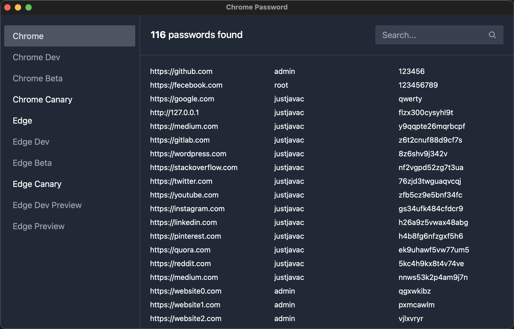

# Steal Password From Browser

~~Steal~~ Get username & password from Chrome. (**Now Only Windows**)

## Install

Download the windows installer(.msi) from
[release page](https://github.com/justjavac/steal_password_from_browser/releases).

## Preview

## Under The Hood

Chrome use a Windows system function called
[CryptProtectData](https://docs.microsoft.com/en-us/windows/win32/api/dpapi/nf-dpapi-cryptprotectdata)
to encrypt passwords stored on computers with a randomly generated key. Only a
user with the same logon credential as the user who encrypted the data can
decrypt the data. In addition, the encryption and decryption usually must be
done on the same computer.

Every password is encrypted with a different random key and stored in a small
database(sqlite) on the computer. The database can be found in the directory
`%LocalAppData%\Google\Chrome\User Data\Default\Login Data`.

## License

[steal_password_from_browser](https://github.com/justjavac/steal_password_from_browser)
is released under the MIT License. See the bundled [LICENSE](./LICENSE) file for
details.
